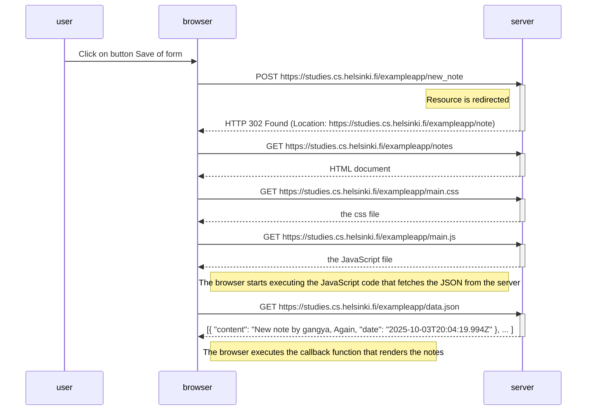

```mermaid

sequenceDiagram
    participant user
    participant browser
    participant server
    
    user ->> browser: Click on button Save of form 
    browser ->> server: POST https://studies.cs.helsinki.fi/exampleapp/new_note
    activate server
    Note left of server: Resource is redirected
    server -->> browser: HTTP 302 Found (Location: https://studies.cs.helsinki.fi/exampleapp/note)
    deactivate server

    browser->>server: GET https://studies.cs.helsinki.fi/exampleapp/notes
    activate server
    server-->>browser: HTML document
    deactivate server

    browser->>server: GET https://studies.cs.helsinki.fi/exampleapp/main.css
    activate server
    server-->>browser: the css file
    deactivate server

    browser->>server: GET https://studies.cs.helsinki.fi/exampleapp/main.js
    activate server
    server-->>browser: the JavaScript file
    deactivate server

    Note right of browser: The browser starts executing the JavaScript code that fetches the JSON from the server
    browser->>server: GET https://studies.cs.helsinki.fi/exampleapp/data.json
    activate server
    server-->>browser: [{ "content": "New note by gangya, Again, "date": "2025-10-03T20:04:19.994Z" }, ... ]
    deactivate server
    Note right of browser: The browser executes the callback function that renders the notes
    
```
