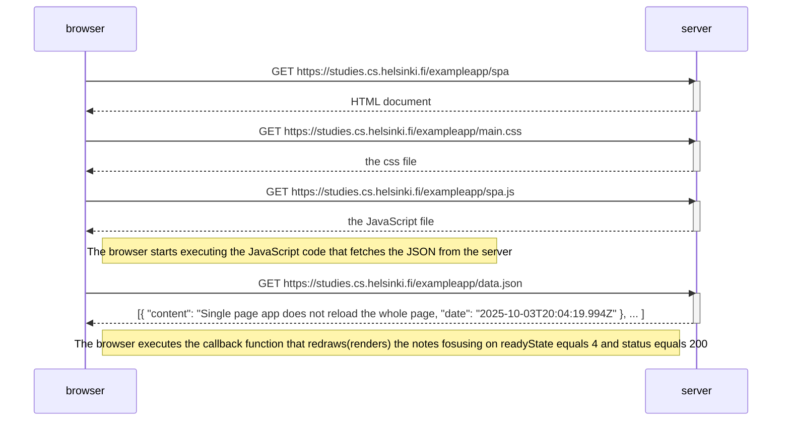

```mermaid

sequenceDiagram

    participant browser
    participant server
    
    browser ->> server: GET https://studies.cs.helsinki.fi/exampleapp/spa
    activate server
    server-->>browser: HTML document
    deactivate server

    browser->>server: GET https://studies.cs.helsinki.fi/exampleapp/main.css
    activate server
    server-->>browser: the css file
    deactivate server

    browser->>server: GET https://studies.cs.helsinki.fi/exampleapp/spa.js
    activate server
    server-->>browser: the JavaScript file
    deactivate server

    Note right of browser: The browser starts executing the JavaScript code that fetches the JSON from the server
    browser->>server: GET https://studies.cs.helsinki.fi/exampleapp/data.json
    activate server
    server-->>browser: [{ "content": "Single page app does not reload the whole page, "date": "2025-10-03T20:04:19.994Z" }, ... ]
    deactivate server
    Note right of browser: The browser executes the callback function that redraws(renders) the notes fosusing on readyState equals 4 and status equals 200  
    
```

