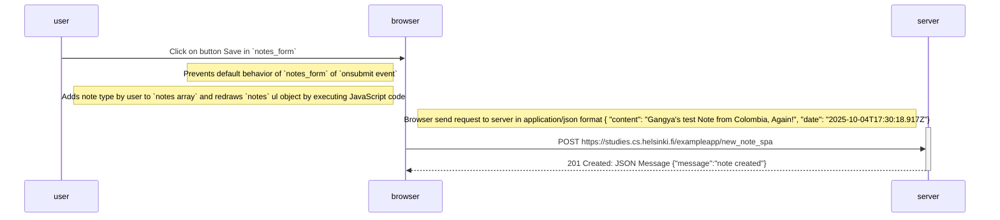

```mermaid
sequenceDiagram
    participant user
    participant browser
    participant server

    user ->> browser: Click on button Save in `notes_form`
    Note left of browser: Prevents default behavior of `notes_form` of `onsubmit event`
    Note left of browser: Adds note type by user to `notes array` and redraws `notes` ul object by executing JavaScript code
    Note right of browser: Browser send request to server in application/json format { "content": "Gangya's test Note from Colombia, Again!",  "date": "2025-10-04T17:30:18.917Z"}
    activate server
    browser ->> server: POST https://studies.cs.helsinki.fi/exampleapp/new_note_spa    
    server-->>browser: 201 Created: JSON Message {"message":"note created"}
    deactivate server
```